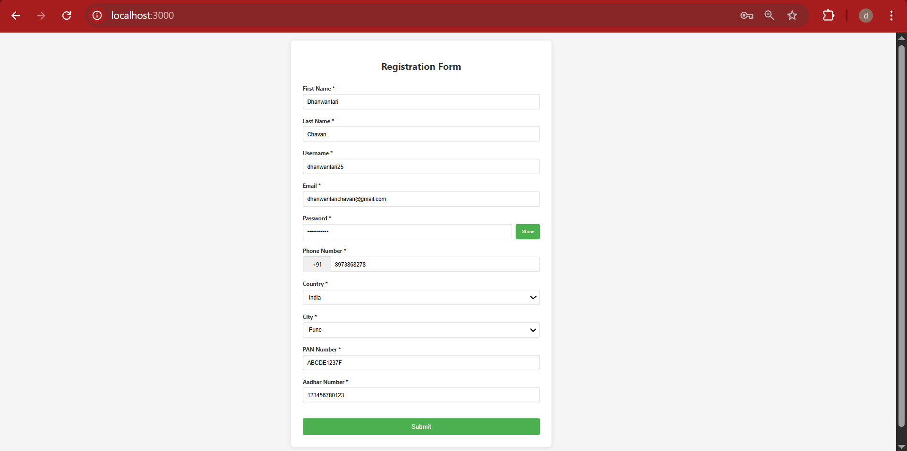

# Form Validation App

A React-based registration form with comprehensive validation and routing functionality.

## Features

- **Complete Form Validation**: Real-time validation for all form fields
- **User-Friendly Interface**: Clean and simple design with error messages
- **Password Security**: Show/hide password functionality 
- **Dynamic Dropdowns**: Country selection affects city options
- **Phone Number Validation**: Country code integration with phone number
- **Document Validation**: PAN and Aadhar number format validation
- **Routing**: Navigation between form and display pages

## Form Fields

- **First Name**: Required, alphabets only, minimum 2 characters
- **Last Name**: Required, alphabets only, minimum 2 characters
- **Username**: Required, alphanumeric, 3-20 characters
- **Email**: Required, valid email format
- **Password**: Required, minimum 8 characters with uppercase, lowercase, number, and special character
- **Phone Number**: Required, 10 digits with country code
- **Country**: Required, dropdown selection
- **City**: Required, dropdown based on selected country
- **PAN Number**: Required, format ABCDE1234F
- **Aadhar Number**: Required, 12 digits


## Project Structure

```
src/
├── components/
│   ├── FormComponent.js      # Main form component with validation
│   ├── DisplayComponent.js   # Display submitted data
│   └── ValidationUtils.js    # Validation functions
├── data/
│   └── countriesData.js      # Countries and cities data
├── App.js                    # Main app with routing
├── App.css                   # Styling
└── index.js                  # Entry point
```

## Technologies Used

- **React**: Frontend framework
- **React Router**: For navigation between pages
- **CSS3**: For styling and responsiveness
- **JavaScript ES6+**: Modern JavaScript features

## Validation Rules

### Password Requirements
- Minimum 8 characters
- At least one uppercase letter
- At least one lowercase letter
- At least one number
- At least one special character (@$!%*?&)

### PAN Number Format
- Format: ABCDE1234F
- 5 uppercase letters, 4 digits, 1 uppercase letter

### Phone Number
- 10 digits only
- Displayed with country code

### Aadhar Number
- Exactly 12 digits


### Routing
- Form page at root route (/)
- Display page at /display route
- Navigation with form data passed via state


## Screenshots

### Registration Form


### Success Page


---

**Note**: This is a demo project for learning React form validation and routing concepts.